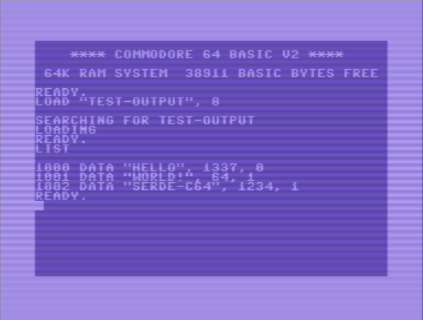

# serde-c64

Commodore 64 BASIC V2 serializer for Serde.

## Example

```rust
use std::fs::File;

fn main() {
    #[rustfmt::skip]
    let test_data = vec![
        ("Hello",     1337, false),
        ("world!",      64, true ),
        ("serde-c64", 1234, true ),
    ];

    let test_output = File::create("disk/test-output").unwrap();
    let options = serde_c64::Options::default();
    serde_c64::to_writer(test_output, &test_data, options).unwrap();
}
```



## License

MIT
